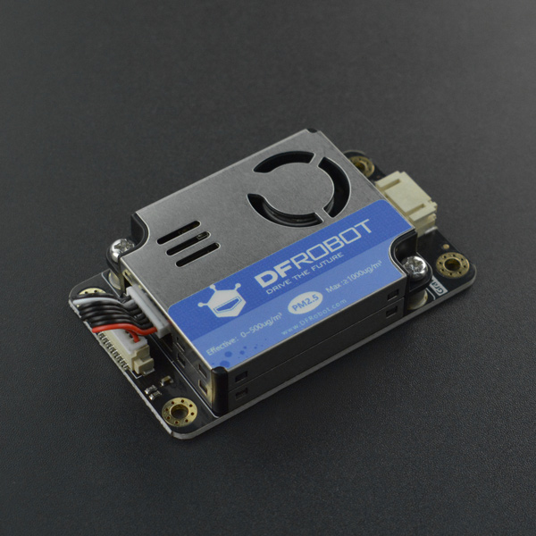

# DFRobot_AirQualitySensor

- [English Version](./README.md)

PM2.5空气质量传感器采用的是一款基于激光散射原理的数字式通用颗粒物传感器，可连续采集并计算单位体积内空气中不同粒径的悬浮颗粒物个数，即颗粒物浓度分布，进而换算成为质量浓度，并利用I2C接口输出相关数据。本传感器可嵌入各种与空气中悬浮颗粒物浓度相关的仪器仪表或环境改善设备，为其提供及时准确的浓度数据。



## 产品链接（[https://www.dfrobot.com.cn/goods-3355.html](https://www.dfrobot.com.cn/goods-3355.html)）

  SKU：SEN0460

## 目录

* [概述](#概述)
* [库安装](#库安装)
* [方法](#方法)
* [兼容性](#兼容性y)
* [历史](#历史)
* [创作者](#创作者)

## 概述

这个库提供了获取空气中指定颗粒物大小以百分比或者以个数输出的例程

## 库安装

要使用这个库，首先将库下载到Raspberry Pi，然后打开例程文件夹。要执行一个例程gainconcentration.py，请在命令行中输入python gainconcentration.py。

## 方法

```python
    '''!
      @brief 获取指定颗粒物类型的浓度
      @param type PARTICLE_PM1_0_STANDARD
      @n          PARTICLE_PM2_5_STANDARD  
      @n          PARTICLE_PM10_STANDARD   
      @n          PARTICLE_PM1_0_ATMOSPHERE
      @n          PARTICLE_PM2_5_ATMOSPHERE
      @n          PARTICLE_PM10_ATMOSPHERE 
      @return 浓度（ug/m3）
    '''
    def gain_particle_concentration_ugm3(self,PMtype):

    '''!
      @brief 获取在0.1升空气中的颗粒物的个数
      @param type PARTICLENUM_0_3_UM_EVERY0_1L_AIR
      @n          PARTICLENUM_0_5_UM_EVERY0_1L_AIR
      @n          PARTICLENUM_1_0_UM_EVERY0_1L_AIR
      @n          PARTICLENUM_2_5_UM_EVERY0_1L_AIR
      @n          PARTICLENUM_5_0_UM_EVERY0_1L_AIR
      @n          PARTICLENUM_10_UM_EVERY0_1L_AIR 
      @return 颗粒物个数
    '''
    def gain_particlenum_every0_1l(self,PMtype):

    '''!
      @brief 向传感器的指定寄存器写入数据
      @return 固件版本
    '''
    def gain_version(self):

    '''
      @brief 控制传感器进入低功耗模式
    '''
    def set_lowpower(self):

    '''
      @brief 控制传感器唤醒
    '''
    def awake(self):

    '''
      @brief writes data to a register
      @param reg register address
      @param data written data
    '''
    def write_reg(self, reg, data):

    '''
      @brief read the data from the register
      @param reg register address
      @param data read data
    '''
    def read_reg(self, reg ,len):
``` 

## 兼容性

| 主板         | 通过 | 未通过 | 未测试 | 备注 |
| ------------ | :--: | :----: | :----: | :--: |
| RaspberryPi2 |      |        |   √    |      |
| RaspberryPi3 |      |        |   √    |      |
| RaspberryPi4 |  √   |        |        |      |

* Python 版本

| Python  | 通过 | 未通过 | 未测试 | 备注 |
| ------- | :--: | :----: | :----: | ---- |
| Python2 |  √   |        |        |      |
| Python3 |  √   |        |        |      |

## 历史

- 2021/11/23 - 1.0.0 版本

## 创作者

Written by PengKaixing(kaixing.peng@dfrobot.com), 2021. (Welcome to our [website](https://www.dfrobot.com/))